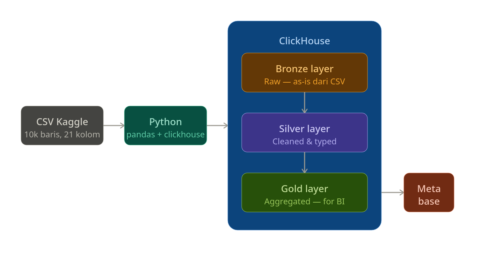

# Retail-Sales-ELT

Pipeline ELT end-to-end untuk mengolah data penjualan retail **Superstore** (Kaggle) menjadi insight bisnis yang siap divisualisasikan. <br>Proyek ini memakai **Medallion Architecture** (Bronze -> Silver -> Gold) dengan ClickHouse sebagai data warehouse dan Metabase sebagai dashboard BI.


## 📊 Stack

Teknologi utama yang dipakai di proyek ini.

| Komponen           | Tool                                       |
| ------------------ | ------------------------------------------ |
| **Data Source**    | Kaggle Superstore                          |
| **Data Warehouse** | ClickHouse 24.3                            |
| **ETL**            | Python 3.12+, pandas 3.0,<br>dbt Core 1.11 |
| **Visualization**  | Metabase  0.60.1                           |
| **Container**      | Docker Compose                             |
| **Exploration**    | Jupyter 1.1.1,<br> notebook 7.2.0          |

## 🏗️ Arsitektur Proyek

Diagram alur data utama dari sumber CSV sampai visualisasi di Metabase.



## 📁 Struktur Proyek

Daftar folder dan file utama di repositori ini.

```bash
retail-sales-elt/
├── data/
│   └── samplesuperstore.csv        # Dataset Kaggle
│
├── docs/
│   └── architecture.png            # Diagram arsitektur proyek
│
├── etl/
│   ├── init_clickhouse.py          # Membuat database bronze/silver/gold
│   ├── load_bronze.py              # Load CSV -> layer Bronze
│   └── utils.py                    # Koneksi ClickHouse dan helper
│
├── macros/
│   └── generate_schema_name.sql    # Macro dbt
│
├── models/
│   ├── schema.yml                  # Definisi source dan model dbt
│   ├── silver/
│   │   └── silver_orders.sql       # Pembersihan dan cast tipe data
│   └── gold/
│       ├── gold_orders.sql         # Agregasi per region dan bulan
│       ├── kpi_summary.sql         # KPI utama
│       ├── monthly_sales_trend.sql # Tren penjualan bulanan
│       ├── product_performance.sql # Performa produk terbaik
│       └── region_sales.sql        # Ringkasan sales per region
│
├── notebooks/
│   ├── bronze_verification.ipynb   # Validasi hasil load Bronze
│   └── kpi_data_checks.ipynb       # Pemeriksaan data KPI
│
├── .env.example                    # Template environment variable
├── .gitignore                      # Daftar file/folder yang diabaikan Git
├── README.md                       # Dokumentasi utama proyek
├── dbt_project.yml                 # Konfigurasi dbt
├── docker-compose.yml              # ClickHouse + Metabase
├── profiles.yml                    # Konfigurasi koneksi dbt lokal
└── requirements.txt                # Dependency Python
```

## 📋 Model dbt

Daftar model transformasi yang membentuk layer Silver dan Gold di dbt.

| Model                 | Layer  | Description                                                     |
| --------------------- | ------ | --------------------------------------------------------------- |
| `silver_orders`       | Silver | membersihkan dan mengetik ulang data Bronze.                    |
| `gold_orders`         | Gold   | agregasi sales per `region` dan `order_month`.                  |
| `kpi_summary`         | Gold   | KPI card values untuk Total Sales, Total Profit, Profit Margin. |
| `monthly_sales_trend` | Gold   | tren penjualan bulanan untuk Sales Trend.                       |
| `product_performance` | Gold   | ringkasan top products untuk Product Performance.               |
| `region_sales`        | Gold   | summary sales per region untuk dashboard Region                 |

## 🚀 Langkah-Langkah

### 1) Requirements
- Docker untuk ClickHouse dan Metabase
- Python 3.12+ (3.14 belum didukung dbt pada saat README ini ditulis)
- File `samplesuperstore.csv` dari Kaggle sudah ada di folder `data/`

### 2) Persiapan

```bash
# Clone repo
git clone https://github.com/itsceyuu/Retail-Sales-ELT
cd Retail-Sales-ELT

cp .env.example .env            # Copy .env.example to .env dan edit jika diperlukan

pip install -r requirements.txt # Install dependency Python

# (Opsional) Pake virtual environment, direkomendasikan kalo pke Linux
python -m venv venv
source venv/bin/activate
pip install -r requirements.txt

docker compose up -d            # Jalankan ClickHouse dan Metabase
```
### 3) Memuat Data dan Menjalankan transformasi

```bash
python etl/init_clickhouse.py   # Inisialisasi database (bronze, silver, gold)
python etl/load_bronze.py       # Load data ke Bronze

dbt run                         # Jalankan transformasi dbt untuk Silver dan Gold
```

### 4) Membuka Metabase
- Buka browser ke `http://localhost:3000`
- Selesaikan setup awal Metabase (email dan password)
- Hubungkan ke ClickHouse dengan konfigurasi berikut:

| Field    | Nilai                |
| -------- | -------------------- |
| Type     | ClickHouse           |
| Host     | `clickhouse`         |
| Port     | `8123`               |
| Database | `bronze/silver/gold` |
| Username | `admin`              |
| Password | `admin123`           |

## 📚 Referensi

- [dbt Documentation](https://docs.getdbt.com)
- [ClickHouse Docs](https://clickhouse.com/docs)
- [Metabase Setup](https://www.metabase.com/docs/latest)
- [Kaggle Superstore Dataset](https://www.kaggle.com/datasets/brittabegley/superstore-sales)
